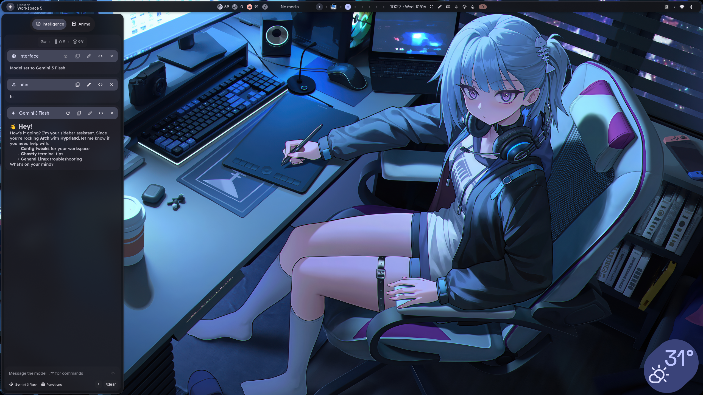

# Dots

My personal dotfiles for Arch Linux, managed with GNU Stow.

<p align="center">
  
</p>

## Environment

- Arch Linux
- Hyprland
- Neovim (LazyVim)
- Zsh (Oh My Zsh + zsh-vi-mode)
- Ghostty
- Starship
- Matugen
- Git
- User systemd services

## Prerequisites

Install GNU Stow:

```bash
sudo pacman -S stow
```

## Repository Structure

```text
.
├── ghostty
├── git
├── haruna
├── hypr
├── illogical-impulse
├── kitty
├── matugen
├── nvim
├── quotes
├── ssh
├── starship
├── systemd
├── zsh
└── README.md
```

### Package Overview

| Package           | Purpose                                         |
| ----------------- | ----------------------------------------------- |
| ghostty           | Ghostty terminal configuration                  |
| git               | Git configuration                               |
| haruna            | Haruna media player configuration               |
| hypr              | Hyprland configuration                          |
| illogical-impulse | Illogical Impulse Hyprland setup/customizations |
| kitty             | Kitty terminal configuration                    |
| matugen           | Dynamic color generation                        |
| nvim              | Neovim (LazyVim) configuration                  |
| quotes            | Personal quotes and notes                       |
| ssh               | SSH client configuration (no private keys)      |
| starship          | Starship prompt configuration                   |
| systemd           | User systemd services and timers                |
| zsh               | Zsh and Oh My Zsh configuration                 |

## Installation

Clone the repository:

```bash
git clone git@github.com:nitin-dixit/dots.git ~/dotfiles
cd ~/dotfiles
```

Stow individual packages:

```bash
stow nvim
stow zsh
stow git
stow hypr
stow ghostty
stow starship
stow systemd
```

Or stow everything:

```bash
stow */
```

## Systemd User Services

After stowing systemd files:

```bash
systemctl --user daemon-reload
systemctl --user enable --now wallpRotate.timer
```

## Useful Packages

On a fresh Arch installation, you may want:

```bash
sudo pacman -S \
  stow \
  git \
  neovim \
  zsh \
  ghostty \
  kitty \
  starship \
  hyprland
```

Additional packages may be required depending on your configuration.

## Notes

- Private keys, tokens, credentials, and secrets are excluded from this repository.
- SSH configuration is tracked, but SSH private keys are not.
- These dotfiles reflect my personal workflow and are optimized for Arch Linux and Hyprland.
